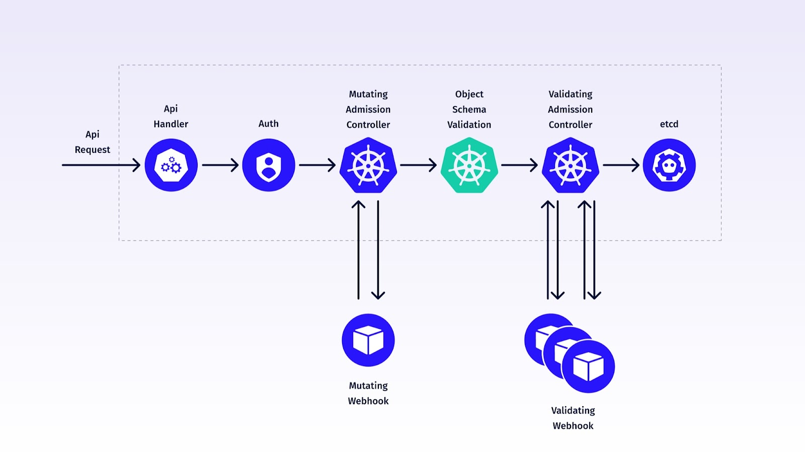
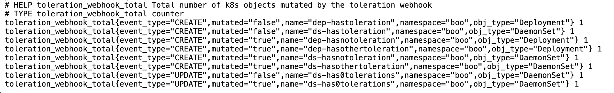

# K8s Mutating Webhook that adds toleration to Deployments and DaemonSets

## Overview

This project implements a Kubernetes MutatingAdmissionWebhook, serving as an [admission controller](https://kubernetes.io/docs/reference/access-authn-authz/admission-controllers/) in the Kubernetes cluster. 
The webhook intercepts Deployment/DaemonSet CREATE and UPDATE requests and automatically adds a toleration and annotation:

```
# Toleration added
tolerations:
    - key: "SimulateNodeFailure"
        operator: "Exists"
        effect: "NoExecute"

# Annotation added
annotation:
   toleration/updated_at: Tue Aug 29 23:55:09 AEST 2023
```

## Admission Controllers and webhooks in the K8s Architecture



## Prerequisites

Before getting started with the webhook, ensure that the following tools and resources are available:

- **Docker**: The webhook runs as a container, so Docker is necessary.
- **Kubernetes Cluster**: You'll need a running Kubernetes cluster where the webhook will be deployed.
   - Use my [terraform code](https://github.com/andreistefanciprian/terraform-kubernetes-gke-cluster) to build a Private GKE Cluster for this purpose. Or use Kind or Docker-Desktop to build a local cluster
- **cert-manager**: Required for generating TLS certificates for the webhook and injecting caBundle in webhook configuration.
   - You can install cert-manager with [helm](https://artifacthub.io/packages/helm/cert-manager/cert-manager) or use my [flux config](https://github.com/andreistefanciprian/flux-demo/tree/main/infra/cert-manager).
- **Go**: The webhook is written in Go.
- **jq**: Used for parsing and manipulating JSON data in the Makefile.
- **Makefile**: The project uses a Makefile for automation and building. Understanding Makefile syntax will help you work with the provided build and deployment scripts.
- **Kustomize**: Used for bulding the test scenario manifests.

**Note**: In case you are using your own credentials for the container registry, make sure you set up these credentials as Github Secrets for your repo.
These credentials are used by Github Actions to push the image to dockerhub.

   ```
   # Set Github Actions secrets
   TOKEN=<dockerhub_auth_token>
   gh secret set DOCKERHUB_USERNAME -b"your_username"
   gh secret set DOCKERHUB_TOKEN -b"${TOKEN}"
   ```

## Build and Run the Webhook

Build, Register, Deploy and Test the webhook using the provided tasks:

1. Build and push the Docker image to the container registry:
   ```
   # run unit tests
   make test

   # build and push image
   make build
   ```

2. Check webhook manifests that will be installed:
   ```
   make template
   ```

3. Deploy and Register webhook:
   ```
   # install a test deployment before webhook is installed so we can test UPDATE Event later on
   kustomize build infra/test-update | kubectl apply -f -

   # install webhook
   make install
   ```
   

4. Test webhook:
   ```
   # check UPDATE Events
   kubectl patch deployment dep-has0tolerations -n boo --type='json' -p='[{"op": "add", "path": "/metadata/annotations/patch", "value": "test"}]'
   kubectl get deployment dep-has0tolerations -n boo -o yaml
   kubectl patch daemonset ds-has0tolerations -n boo --type='json' -p='[{"op": "add", "path": "/metadata/annotations/patch", "value": "test"}]'
   kubectl get daemonset ds-has0tolerations -n boo -o yaml

   # check CREATE Events
   kustomize build infra/test-create | kubectl apply -f -
   kubectl get daemonset ds-hasnotoleration -n boo -o yaml
   kubectl get daemonset ds-hasothertoleration -n boo -o yaml
   kubectl get daemonset ds-hastoleration -n boo -o yaml
   kubectl get deployment dep-hasnotoleration -n boo -o yaml
   kubectl get deployment dep-hasothertoleration -n boo -o yaml
   kubectl get deployment dep-hastoleration -n boo -o yaml

   # Check prometheus metrics
   k port-forward svc/toleration-webhook -n toleration-webhook 8090:8090
   http://localhost:8090/metrics



   # remove tests
   kustomize build infra/test-create | kubectl delete -f -
   kustomize build infra/test-update | kubectl delete -f -
   ```

5. Remove webhook:
   ```
   make uninstall
   ```

Feel free to adjust the tasks and configurations as needed to fit your specific environment.

## License

This project is licensed under the [MIT License](LICENSE). Feel free to use and modify it according to your requirements.